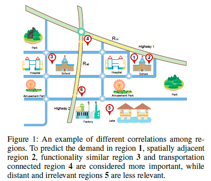

The task of house price prediction has received significant attention in both academia and stakeholders for decades. Over the years, researchers have used different techniques to build effective models for house price predictions. For example, typical Hedonic Price models have been extensively studied to model the relationship between prices and housing features. While the early models based on ordinary least square (OLS) context did not include spatial awareness, researchers gradually realized the impact of regional submarkets in house price prediction. To incorporate the locational influence, several works used spatial statistical methods since simple hedonic models are not much effective in handling spatial dependence in regression residuals. However, these spatial statistical methods require explicit feature engineering by domain experts. Following the success of machine learning in different fields, in recent years, SVM, Convolutional Neural Networks, and Recurrent Neural Networks have been employed to better capture the preferences for more accurate house price prediction. House images have also been leveraged for better price estimation. Unlike OLS based hedonic models, these modern learning algorithms can effectively **capture the spatial dependence from location attributes** which obviates the need of explicit feature engineering.

Although most of the recent prior works leverage the detailed housing and location features, they overlook the geo-spatial contexts such as “how close is this house to the train station?”, or “is there any good school in walking distance from the house?”. These geo-spatial contexts based on neighbourhood facilities can greatly influence user preferences on buying a house and hence can be key determining factors for the price of the house. To illustrate, suppose that there are two houses with the same set of features such as the number of bedrooms, house areas, etc., in the same suburb. However, there may have variations in their prices. For example, a house next to the train station will likely have a much higher price than the house which is far away (e.g. 3km distance) from the train station. Similarly, houses in a certain suburb with good schools in the neighborhood and a train station for commuting to the city will have higher prices than those houses in a nearby suburb that does not have a good school and a train station in its neighborhood. Hence, points of interests (POIs) such as train stations, schools, shopping centers, etc. in the neighborhood can play key roles in determining the house prices. To the best of our knowledge, none of the prior works capture the important features related to neighborhood POIs and their relationship with houses.

It is not straightforward to capture complex latent interactions between houses and POIs as it involves connectivity among different entities (e.g. how close a house is to the train station) as well as heterogeneous sets of features of these entities (e.g. how good a school is). Recently, an approach by Jenkins et. al. used satellite image, taxi mobility data, and the existence of different categories of point of interests for generating an embedding for a region, which are later used to a get a coarse outline of price distribution per sqft for houses in that region. Though this work can capture the regional features using complex sets of data, they neither consider detailed houses and POIs features nor the relationships between neighborhood POIs and the corresponding house.

In this paper,a novel geo-spatial network embedding framework to accurately **capture the geo-spatial neighborhood relationships** between houses and surrounding POIs.

## Review 

### Hedonic model

### GWR model

Dong, G., Nakaya, T. and Brunsdon, C. (2018) ‘Geographically weighted regression models for ordinal categorical response variables: An application to geo-referenced life satisfaction data’, Computers, Environment and Urban Systems, 70, pp. 35–42. doi: 10.1016/j.compenvurbsys.2018.01.012.

Zhang, H. et al. (2011) ‘Modeling hotel room price with geographically weighted regression’, International Journal of Hospitality Management, 30(4), pp. 1036–1043.

### GCN

## Methods

* Spatial relationships

Geng, X., Li, Y., Wang, L., Zhang, L., Yang, Q., Ye, J., Liu, Y., & Contribution, E. (n.d.). *Spatiotemporal Multi-Graph Convolution Network for Ride-hailing Demand Forecasting*. 8.

these methods mainly focus on modeling the Euclidean correlations among different regions, however, we observe that non-Euclidean pair-wise correlations are also critical for accurate forecasting. Figure 1 shows an example. For region 1, in addition to neighborhood region 2, it may also correlate to a distant region 3 that shares similar functionality, i.e., they are both near schools and hospitals. Besides, region 1 may also be affected by region 4, which is directly connected to region 1 via a highway.

## Replicate related research

### POI2vec

### STMGCN